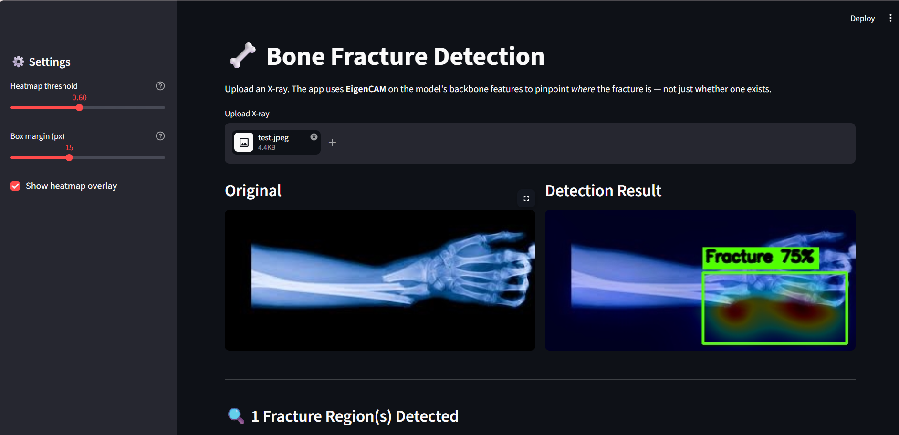

<div align="center">

# 🦴 AI-Powered Bone Fracture Detection Engine
### *A Dual-Head Deep Learning Framework combining YOLOv8 Precision with EigenCAM Interpretability*

[](https://www.python.org/)
[](https://streamlit.io/)
[](https://ultralytics.com/)
[](https://www.docker.com/)
[](LICENSE)

<p align="center">
  <b>An advanced medical imaging web application engineered to parse complex orthopedic radiographs, automatically localized using robust object detection heads backed by raw neural focus map projections.</b>
</p>

---
[✨ Live Demo](#) • [🛠️ Architecture](#-system-architecture) • [🐳 Docker Guide](#-docker-containerization) • [📦 Dependencies](#-headless-tech-stack)
---
</div>

## 🌟 Highlights & Capabilities

| Feature | Technical Implementation | Core Benefit |
| :--- | :--- | :--- |
| **🎯 Absolute Localization** | Custom script decoupling YOLOv8 native regression heads from raw layers. | Eliminates false positives along dark X-ray borders and film artifacts. |
| **🔥 Deep Explainability** | EigenCAM spatial visual focus mapping on backbone layers `6, 12, 15, 18`. | Highlights the exact structural stress areas using Singular Value Decomposition. |
| **🎛️ Real-Time Telemetry** | Automated Pandas-to-Streamlit UI framework with confidence sliders. | Clinicians can alter strictness matching scales instantly on the fly. |

---
**AI Dual-Head Output (YOLOv8 + EigenCAM Feature Extraction):**



## 🧠 System Architecture

Traditional Class Activation Mapping (CAM) logic frequently bleeds into raw background space due to dense black X-ray margins. This engine resolves that drawback by running a **Dual-Head Pipeline**:

```mermaid
graph TD
    A[Uploaded X-Ray Image] --> B[YOLOv8 Detection Head]
    A --> C[EigenCAM Feature Hook]
    B --> D[Strict Non-Maximum Suppression]
    C --> E[Backbone Matrix Power Iteration SVD]
    D --> F[High-Precision Coordinate Boxes]
    E --> G[Subtle Alpha Thermal Overlay]
    F --> H[Merged Analytical Output Result]
    G --> H
